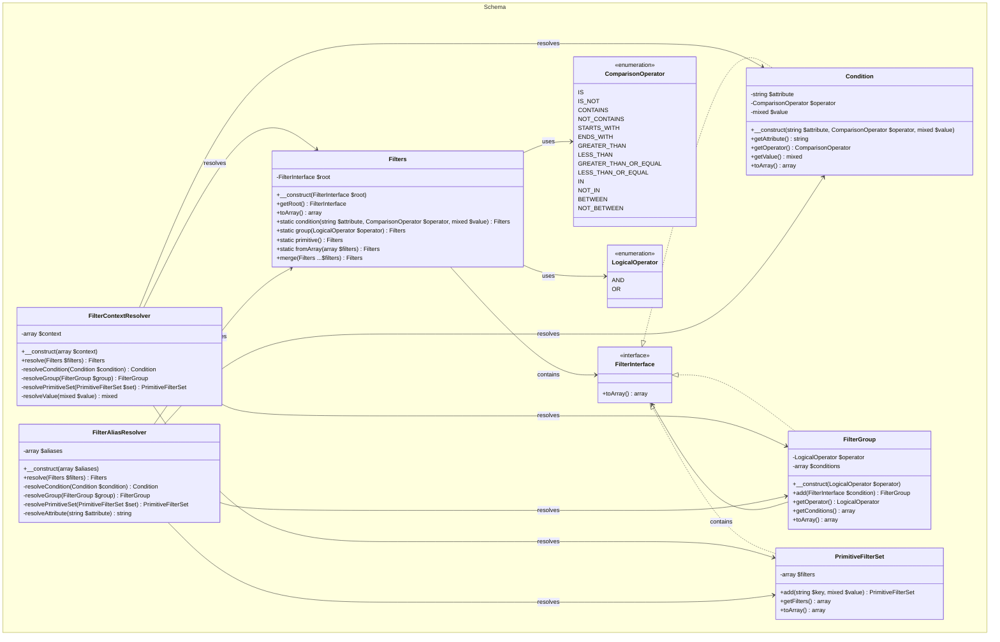

# 🎯 Filter Implementation Guide

This guide explains how to implement the Locospec filter system based on the provided class diagram. The filter system is designed to be flexible, composable, and capable of handling complex query conditions.

## 📊 Class Diagram



## 🏗️ Core Components

### 1. FilterInterface

The base interface that all filter types must implement:

- Defines the contract for converting filters to array representation
- Ensures consistent serialization across all filter types
- Enables polymorphic handling of different filter types

### 2. Condition

Represents a single filter condition:

- Stores attribute name, operator, and value
- Implements basic comparison operations
- Provides immutable access to its properties
- Converts to array format for serialization

### 3. FilterGroup

Handles logical grouping of conditions:

- Supports AND/OR operations between conditions
- Can contain nested conditions and groups
- Provides methods for adding new conditions
- Maintains operator type and condition list

### 4. PrimitiveFilterSet

Simplifies basic key-value filters:

- Stores simple attribute-value pairs
- Useful for basic equality conditions
- Provides easy addition of new filters
- Converts to standard filter format

### 5. Filters

The main entry point for filter operations:

- Manages the root filter element
- Provides static factory methods
- Supports filter merging
- Handles array conversion

## 🔄 Resolvers

### 1. FilterContextResolver

Resolves dynamic values in filters:

- Processes context variables in filter values
- Handles nested context resolution
- Maintains context state
- Resolves all filter types

### 2. FilterAliasResolver

Manages attribute aliases:

- Maps alias names to actual attributes
- Supports complex alias patterns
- Resolves aliases in all filter types
- Maintains alias definitions

## 🎨 Implementation Approach

### 1. Base Structure

1. Implement the `FilterInterface`
2. Create the operator enumerations
3. Build the core filter classes
4. Implement the resolver classes

### 2. Filter Building

```plaintext
1. Start with Filters class
2. Use static factory methods
3. Build conditions or groups
4. Add to filter structure
```

### 3. Resolution Process

```plaintext
1. Create resolver instances
2. Pass filters through resolvers
3. Handle context/alias resolution
4. Return resolved filters
```

## 📝 Usage Examples

### 1. Simple Condition

```plaintext
Filters::condition('status', ComparisonOperator::IS, 'active')
```

### 2. Complex Group

```plaintext
Filters::group(LogicalOperator::AND)
    ->add(Filters::condition('status', ComparisonOperator::IS, 'active'))
    ->add(Filters::condition('type', ComparisonOperator::IN, ['user', 'admin']))
```

### 3. With Context

```plaintext
$context = ['user_id' => 123];
$resolver = new FilterContextResolver($context);
$filters = Filters::condition('created_by', ComparisonOperator::IS, '{user_id}');
$resolved = $resolver->resolve($filters);
```

## 🔍 Implementation Checklist

- [ ] Implement `FilterInterface`
- [ ] Create operator enumerations
- [ ] Build core filter classes
- [ ] Implement resolver classes
- [ ] Add factory methods
- [ ] Implement serialization
- [ ] Add resolution logic
- [ ] Create test cases

## ⚠️ Important Considerations

1. **Immutability**

   - Filter objects should be immutable
   - Operations should return new instances
   - Prevent accidental modifications

2. **Type Safety**

   - Validate operator types
   - Check value types
   - Handle null values appropriately

3. **Performance**

   - Optimize resolution process
   - Cache resolved values
   - Minimize object creation

4. **Error Handling**
   - Validate input parameters
   - Handle resolution errors
   - Provide meaningful error messages
